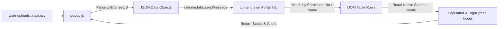

# IP Portal Autofill — Chrome Extension

A lightweight, automated browser extension (Manifest V3) designed to parse Excel (`.xlsx`, `.xls`) or CSV files and automatically populate student assessment and marks tables on the [Demo IP Portal](https://ip-portal-automation.vercel.app/students).

---

##  Features

- ** One-Click Table Autofill**: Reads your uploaded spreadsheet and matches each student record directly to the corresponding row in the webpage table.
- ** Full React / SPA Reactivity**: Uses native prototype property setters (`HTMLInputElement.prototype.value`) and dispatches bubbling synthetic events (`input`, `change`, `blur`), ensuring React state updates and validation buttons enable correctly.
- ** Offline & Secure**: Bundled with a local copy of [SheetJS](https://sheetjs.com/) (`xlsx.full.min.js`) — no external scripts or CDNs are contacted, complying strictly with Manifest V3 Content Security Policies.
- ** Domain Restricted**: Configured specifically to run safely and exclusively on `https://ip-portal-automation.vercel.app/students*`.
- ** Visual Feedback**: Automatically highlights modified input fields with a soft green indicator and returns real-time fill counts.
- ** Smart Column & Key Matching**: Supports multiple variations of column headers and normalizes leading zeros and whitespace.

---

##  File Structure

```text
AutomationExtention/
├── manifest.json         # Extension manifest (Manifest V3 configuration & permissions)
├── popup.html            # Extension popup UI (file dropzone, file info, autofill button)
├── popup.js              # Popup script (Excel parsing via SheetJS & tab communication)
├── content.js            # Content script injected into the portal page (DOM matcher & input injector)
├── xlsx.full.min.js      # Standalone offline SheetJS parsing library
└── icons/                # Extension icon assets
    ├── icon16.png        # 16x16 icon (toolbar & tab)
    ├── icon48.png        # 48x48 icon (extensions manager)
    └── icon128.png       # 128x128 icon (webstore & detail view)
```

---

## Installation & Setup Guide

### 1. Prerequisites
- A Chromium-based web browser: **Google Chrome**, **Microsoft Edge**, **Brave**, or **Opera**.

### 2. Load the Extension into your Browser
1. Open your browser and navigate to the Extensions management page:
   - **Chrome / Brave**: `chrome://extensions/`
   - **Microsoft Edge**: `edge://extensions/`
2. Enable **Developer mode** using the toggle in the top-right corner.
3. Click the **Load unpacked** button in the top-left toolbar.
4. Browse and select the project directory:
   ```text
   D:\IP_Portal_Automation\AutomationExtention
   ```
5. The **TableAutoFill** extension is now installed and will appear in your browser's extension list and toolbar.

---

##  How to Use

1. Navigate to the IP Portal students page:
   ```text
   https://ip-portal-automation.vercel.app/students
   ```
2. Click the **IP Portal Autofill** icon in your browser toolbar to open the popup.
3. **Upload File**: Drag and drop `TableExport.xlsx` (or click to browse your `.xlsx` / `.csv` file).
   - The popup will immediately display the file name and the number of records detected.
4. **Autofill**: Click the **⚡ Autofill Web Page** button.
5. **Review**:
   - The extension matches rows by **Enrollment Number** or **Student Name**.
   - Input fields will be filled with the allotted marks and highlighted in green.
   - The popup will confirm the total number of student records successfully updated.

---

## Supported Spreadsheet Column Headers

The extension automatically detects any of the following common column naming conventions:

| Field Type | Supported Spreadsheet Header Names |
| :--- | :--- |
| **Enrollment / ID Key** | `Enlorrment Number`, `Enrollment Number`, `Enrollment No`, `Roll No`, `RollNo`, `ID` |
| **Student Name** | `Name`, `Student Name` |
| **Marks to Allot** | `Marks Alloted`, `Marks Allotted`, `Marks`, `Internal Marks`, `Score` |

---

## Technical Architecture



### React Event Dispatching
Standard DOM assignments (`input.value = x`) do not notify React's internal state tracker. This extension resolves this by invoking the prototype descriptor setter:
```javascript
const nativeInputValueSetter = Object.getOwnPropertyDescriptor(
  window.HTMLInputElement.prototype,
  'value'
)?.set;

nativeInputValueSetter.call(inputElement, value);
inputElement.dispatchEvent(new Event('input', { bubbles: true, composed: true }));
inputElement.dispatchEvent(new Event('change', { bubbles: true, composed: true }));
```

---

## Troubleshooting

- **"Please open https://ip-portal-automation.vercel.app/students"**: Ensure your active browser tab is on the students page before triggering the autofill.
- **"Could not communicate with tab"**: Refresh the portal webpage once after installing or reloading the extension so the content script is actively injected.
- **Values not updating**: Check that your spreadsheet contains one of the supported header names listed in the table above.
