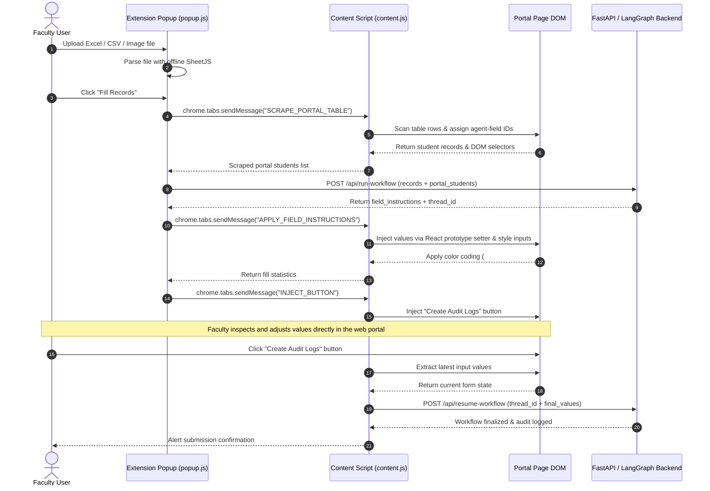

# IP Portal Autofill - Browser Automation Extension

The IP Portal Autofill extension is a Manifest V3 browser automation tool designed to bridge local evaluation spreadsheets with the web portal. It parses tabular student records, communicates with the Python intelligence backend to perform multi-stage record matching, and injects assessment marks directly into the live web page while ensuring full reactivity with modern React-based user interfaces.

---

## Technical Architecture

The extension operates across three distinct execution contexts: the browser popup UI, the content script embedded in the active tab, and the FastAPI/LangGraph backend service.



---

## Key Technical Features

### 1. Two-Stage Execution Lifecycle
- **Stage 1 (Match and Fill)**: Ingests spreadsheet data, extracts target DOM elements from the live page, executes backend matching, and populates the table with visual status indicators.
- **Stage 2 (Rescan and Audit)**: After the user reviews and manually corrects any flagged entries in the browser, they click the injected "Create Audit Logs" button on the web page. The extension then rescans current DOM input values and sends them directly from the web page to the backend to complete the audit run in PostgreSQL.

### 2. React SPA Event Dispatching
Standard DOM assignments such as `element.value = newValue` fail in modern Single-Page Applications because React tracks input state using internal fiber descriptors. The extension bypasses this limitation by accessing the native HTMLInputElement setter and dispatching bubbling synthetic events:

```javascript
const nativeInputValueSetter = Object.getOwnPropertyDescriptor(
  window.HTMLInputElement.prototype,
  'value'
)?.set;

if (nativeInputValueSetter) {
  nativeInputValueSetter.call(inputElement, value);
} else {
  inputElement.value = value;
}

inputElement.dispatchEvent(new Event('input', { bubbles: true, composed: true }));
inputElement.dispatchEvent(new Event('change', { bubbles: true, composed: true }));
inputElement.dispatchEvent(new Event('blur', { bubbles: true, composed: true }));
```

### 3. Visual Status Annotations
Inputs on the portal page are dynamically annotated based on confidence ratings received from the backend:
- **Green (`#e6ffe6`)**: Confirmed exact or high-confidence match (confidence > 0.90).
- **Orange (`#eec890`)**: Flagged heuristic or low-confidence match requiring user verification.
- **Red (`#ee9090`)**: Unmatched, parse error, or invalid mark left for manual entry.
- Hovering over any annotated field reveals a tooltip with the matching rationale and confidence score.

### 4. Fully Offline Parsing and Security
The extension includes a standalone bundle of SheetJS (`xlsx.full.min.js`), eliminating remote CDN calls and adhering strictly to Manifest V3 Content Security Policies.

---

## File Structure

```text
AutomationExtention/
├── icons/
│   ├── icon16.png        # 16x16 icon (toolbar and tab)
│   ├── icon48.png        # 48x48 icon (extensions manager)
│   └── icon128.png       # 128x128 icon (webstore and detail view)
├── content.js            # Injected content script for DOM scraping, React input injection, and rescanning
├── manifest.json         # Chrome Extension Manifest V3 configuration and permission declarations
├── popup.html            # Extension popup user interface (dropzone, file details, action controls)
├── popup.js              # Controller logic for SheetJS parsing, tab messaging, and backend coordination
├── xlsx.full.min.js      # Offline standalone SheetJS spreadsheet parser
└── README.md             # Extension documentation
```

---

## Supported Spreadsheet Column Formats

The ingestion engine automatically recognizes varied column header naming conventions:

| Field Identifier | Supported Header Aliases |
| :--- | :--- |
| **Enrollment Number** | `enrolment no`, `enrolment number`, `enrollment no`, `enrollment number`, `roll no`, `roll number`, `enr no` |
| **Student Name** | `name`, `student name`, `full name` |
| **Assessment Marks** | `marks`, `marks obtained`, `internal marks`, `score`, `marks alloted`, `marks allotted` |

---

## Installation and Setup Guide

### 1. Prerequisites
- A Chromium-based browser (Google Chrome, Microsoft Edge, Brave, or Chromium).
- Backend service running locally on `http://127.0.0.1:8000`.

### 2. Load the Unpacked Extension
1. Open the browser and navigate to the extensions management console:
   - **Chrome / Brave**: `chrome://extensions/`
   - **Microsoft Edge**: `edge://extensions/`
2. Enable **Developer mode** via the toggle switch in the top right.
3. Click **Load unpacked** in the top left toolbar.
4. Select the `AutomationExtention` directory from this repository:
   ```text
   d:\Hackathon\SIH-2026\IP_Portal_Automation\AutomationExtention
   ```
5. The extension will appear in the installed extensions list and can be pinned to the browser toolbar.

---

## Usage Instructions

1. Navigate to the marks evaluation page on the portal:
   ```text
   http://localhost:5173/students?sem=1
   ```
2. Click the extension icon in the toolbar to open the popup interface.
3. Drag and drop the Excel (`.xlsx`, `.xls`), CSV file, or image (photo/scan) into the upload dropzone.
4. Verify the detected record count and click **Fill Records**.
5. Observe the automated field population and color coding on the active page.
6. Make any manual corrections on flagged or empty fields directly on the portal page.
7. Click the injected **Create Audit Logs** button on the portal page to record the completed run in the backend audit database.
8. Submit the marks on the portal page.

---

## Troubleshooting

- **"Please open http://localhost:5173/students"**: Ensure the current browser tab is on the active students evaluation page before opening the extension popup.
- **"Could not communicate with tab"**: Refresh the portal web page after loading or updating the extension to ensure the content script is actively injected into the page DOM.
- **"Error running workflow: Backend returned status..."**: Verify that the Python backend service is actively running on `http://127.0.0.1:8000` with the appropriate virtual environment and dependencies.
- **Unmatched Rows**: Check that spreadsheet columns match one of the supported header alias conventions and that marks values are within the allowable range (0 to 40).
