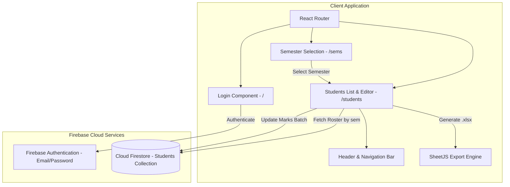

# IP Portal Automation - Demo Portal

The Demo Portal is a React-based web application designed to simulate a university examination and internal marks evaluation portal. Built with Vite, Tailwind CSS, and Firebase (Authentication and Cloud Firestore), it provides faculty members with a secure interface to review student rosters, enter marks, submit updates to a cloud database, and export evaluation sheets.

---

## Architecture and Design

The portal operates as a single-page application (SPA) with declarative client-side routing and reactive state management. Data persistence and session authentication are managed via the Firebase Web SDK.



---

## Route and Component Breakdown

| Route | Component | Description |
| :--- | :--- | :--- |
| `/` | `Login.jsx` | Authenticates faculty users via email and password credentials. Redirects to `/sems` upon successful login. |
| `/sems` | `Sems.jsx` | Semester selection grid (Semesters 1, 3, 5, and 7). Navigates to `/students?sem={n}`. |
| `/students?sem={n}` | `Students.jsx` | Fetches student rosters for the selected semester, renders the assessment table with interactive number inputs, handles state updates, and executes Firestore batch updates. |
| `/logout` | `logout.jsx` | Terminates the active Firebase Auth session and routes back to `/`. |

### Key Component Details

- **`Students.jsx`**:
  - Implements session authentication guards via `checklogin()`.
  - Sorts student records by enrollment number prefixes.
  - Manages real-time input modifications in component state with boundary constraints (0 to 40).
  - Provides client-side Excel workbook generation (`ExportData`) utilizing SheetJS (`XLSX.utils.aoa_to_sheet`).
  - Executes batch updates (`HandelSubmit`) to update Firestore documents for modified student scores.
- **`header.jsx`**:
  - Provides a persistent top navigation bar with application branding and an integrated sign-out action.
- **`loader.jsx`**:
  - Displays a centered loading animation during asynchronous Firestore queries and route transitions.
- **`firebase.js`**:
  - Centralizes Firebase app configuration, authentication lifecycle listeners, and Firestore document query/update operations.

---

## Data Model (Cloud Firestore)

The application communicates with a root-level Firestore collection named `Students`.

```json
{
  "Students": [
    {
      "id": "firestore_auto_doc_id",
      "enrollment_no": "00112345678",
      "name": "Alex Doe",
      "sem": 1,
      "marks": 38
    }
  ]
}
```

### Collection Schema Definition

| Field Name | Type | Description | Constraints |
| :--- | :--- | :--- | :--- |
| `enrollment_no` | `string` | Unique student university enrollment number | 11-digit alphanumeric string |
| `name` | `string` | Full name of the student | Non-empty string |
| `sem` | `number` | Semester index | Integer (e.g., 1, 3, 5, 7) |
| `marks` | `number` | Internal assessment score | Float or integer between 0 and 40 |

---

## File Structure

```text
DemoPortal/
├── src/
│   ├── assets/              # Static media assets and logos
│   ├── components/
│   │   ├── header.jsx       # Global application header and navigation controls
│   │   ├── loader.jsx       # Loading spinner component
│   │   ├── Login.jsx        # Firebase email/password authentication view
│   │   ├── logout.jsx       # Sign-out handler component
│   │   ├── Sems.jsx         # Semester selection dashboard
│   │   └── Students.jsx     # Student evaluation table and marks management
│   ├── firebase.js          # Firebase SDK initialization and database helper functions
│   ├── index.css            # Global CSS styles and Tailwind directives
│   └── main.jsx             # Application root, React Router initialization
├── .env                     # Local Firebase environment variables (untracked)
├── .gitignore               # Git exclusion rules
├── eslint.config.js         # ESLint configuration
├── index.html               # Vite HTML entry point
├── package.json             # NPM dependencies, scripts, and package metadata
├── package-lock.json        # Locked dependency tree
├── vercel.json              # Vercel SPA client-side routing rewrite rules
├── vite.config.js           # Vite build configuration
└── README.md                # Demo Portal documentation
```

---

## Environment Configuration

Create a `.env` file in the `DemoPortal/` directory with the following variables:

```env
VITE_apiKey=your_firebase_api_key
VITE_authDomain=your-project.firebaseapp.com
VITE_projectId=your_firebase_project_id
VITE_storageBucket=your-project.firebasestorage.app
VITE_messagingSenderId=your_messaging_sender_id
VITE_appId=your_firebase_app_id
VITE_measurementId=your_google_analytics_measurement_id
```

These values can be retrieved from the **Firebase Console > Project Settings > General > Your Apps > SDK Setup and Configuration**.

---

## Local Development and Setup

### 1. Prerequisites
- Node.js version 18.0.0 or higher
- npm (Node Package Manager)
- Active Firebase project with Authentication (Email/Password) and Cloud Firestore enabled

### 2. Install Dependencies

```bash
cd DemoPortal
npm install
```

### 3. Start Development Server

```bash
npm run dev
```

The application will be served locally at `http://localhost:5173`.

### 4. Available NPM Scripts

```bash
npm run dev       # Starts the Vite development server with Hot Module Replacement
npm run build     # Compiles production-ready bundle into the dist/ directory
npm run preview   # Previews the compiled production build locally
npm run lint      # Runs ESLint code quality checks
```

---

## Production Deployment

The project is pre-configured for static hosting on platforms such as Vercel. 

### Single-Page Application (SPA) Routing Configuration
The included `vercel.json` file ensures that all incoming HTTP requests are rewritten to `index.html` to support client-side routing by React Router:

```json
{
  "rewrites": [{ "source": "/(.*)", "destination": "/index.html" }]
}
```

To deploy:
1. Build the production output: `npm run build`.
2. Deploy the generated `dist/` directory.
3. Configure the `VITE_*` environment variables in your hosting provider's project settings dashboard.
