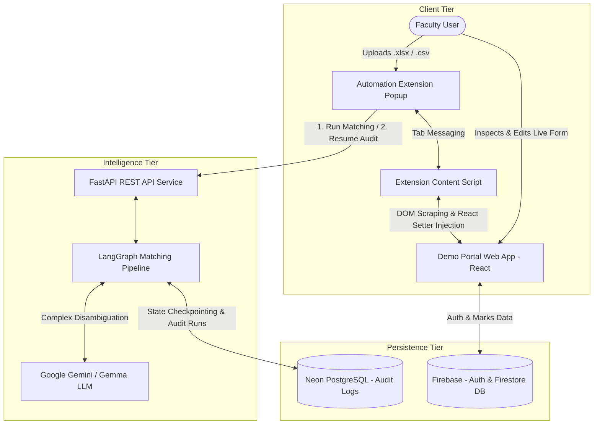

# IP Portal Automation System

The IP Portal Automation System is an intelligent, multi-component automation platform designed to eliminate manual data entry errors and accelerate the process of uploading internal assessment and examination marks into academic portals (such as the GGSIPU IP Portal).

The platform bridges local faculty assessment spreadsheets with web-based evaluation forms using an intelligent multi-tiered matching pipeline (deterministic lookup, heuristic fuzzy matching, and generative AI disambiguation), a Manifest V3 browser extension with native React event synchronization, and an audit trail backed by PostgreSQL.

---

## System Architecture

The ecosystem consists of three primary modules operating in coordination:



---

## Core Modules Overview

### 1. Backend Intelligence Service (`Backend/`)
- **Framework**: FastAPI, LangGraph, LangChain Google GenAI, RapidFuzz, PostgreSQL (`psycopg`).
- **Core Role**: Ingests student records, normalizes headers and identifiers, and executes a multi-tiered matching engine:
  - **Deterministic Matching**: Exact 1:1 enrollment number lookup (confidence 1.0).
  - **Fuzzy Matching**: RapidFuzz weighted ratio algorithms (70% name, 30% enrollment) with safety margin thresholds.
  - **LLM Disambiguation**: Google Gemini / Gemma structured output resolution for complex naming anomalies, missing tokens, and phonetic variations.
  - **Validation & Human-in-the-Loop**: Enforces score boundary checks (0-40) and manages execution interruption/resumption for faculty review.
  - **Audit Logging**: Persists immutable run metrics and data snapshots to PostgreSQL `audit_runs`.
- **Documentation**: For API endpoints, state graph schemas, and setup instructions, see the [Backend Documentation](Backend/README.md).

### 2. Browser Automation Extension (`AutomationExtention/`)
- **Framework**: Chrome Extensions (Manifest V3), SheetJS (`xlsx.full.min.js`), Vanilla JavaScript.
- **Core Role**: In-browser automation engine that bridges offline spreadsheets with the active portal page:
  - **Offline Parsing & Image Support**: Fast, secure parsing of `.xlsx`, `.xls`, and `.csv` files without external CDN dependencies, plus support for mark sheet image uploads.
  - **DOM Scraping & Unique Tagging**: Extracts live student rosters from table DOM elements and assigns deterministic identifiers.
  - **React SPA Reactivity**: Uses native input prototype descriptor setters and dispatches synthetic bubbling events (`input`, `change`, `blur`) to update React 18/19 internal state trackers.
  - **Visual Status Feedback**: Applies background color highlights on portal fields (`#e6ffe6` confirmed, `#eec890` flagged, `#ee9090` empty) with tooltip explanations.
  - **Two-Stage Lifecycle**: Orchestrates initial field injection and subsequent final state rescan for backend audit logging.
- **Documentation**: For browser installation, supported headers, and messaging flows, see the [Automation Extension Documentation](AutomationExtention/README.md).

### 3. Demo Evaluation Portal (`DemoPortal/`)
- **Framework**: React 19, Vite, React Router, Tailwind CSS, Firebase Authentication, Cloud Firestore, SheetJS.
- **Core Role**: Demonstration portal simulating the official university evaluation interface:
  - **Authentication**: Role-based email and password authentication backed by Firebase Auth.
  - **Semester Navigation**: Course and semester routing (`/sems`, `/students?sem={n}`).
  - **Interactive Evaluation Table**: Live tabular student list with real-time marks inputs, Firestore persistence, and client-side Excel export.
- **Documentation**: For Firestore schema details, local server setup, and Vercel deployment, see the [Demo Portal Documentation](DemoPortal/README.md).

---

## End-to-End Operational Workflow

1. **Authentication and Roster Selection**:
   Faculty signs into the Demo Portal, selects the target academic semester, and opens the student marks entry table.
2. **Spreadsheet Ingestion**:
   Faculty opens the IP Portal Autofill extension and uploads their local assessment spreadsheet (`.xlsx`, `.xls`, `.csv`) or a mark sheet image.
3. **DOM Scraping and Matching Execution**:
   The extension scrapes the live student roster from the portal table and transmits both the uploaded records and the portal roster to the FastAPI backend (`POST /api/run-workflow`).
4. **Multi-Stage Intelligence Pipeline**:
   The backend executes the LangGraph workflow:
   - Header aliases and enrollment numbers are cleaned and normalized.
   - Exact records are matched deterministically.
   - Remaining records are scored using RapidFuzz.
   - Ambiguous or non-standard names are resolved via Google Gemini.
   - Marks values are validated against acceptable ranges.
   - Field instructions with visual status indicators are returned to the extension.
5. **DOM Injection and Reactive State Synchronization**:
   The extension applies the field instructions to the portal page, updating the inputs and triggering React state updates. Fields are highlighted green, orange, or red based on matching confidence.
6. **Faculty Verification and Adjustment**:
   Faculty reviews the annotated form on the web page, making manual corrections to any flagged or empty fields.
7. **Audit Logging and Resumption**:
   Faculty clicks "Create Final Logs" in the extension. The extension rescans current form values and sends them to the backend (`POST /api/resume-workflow`), which resumes the paused LangGraph workflow and writes an audit record to the PostgreSQL database.
8. **Final Portal Submission**:
   Faculty clicks "Submit" on the portal page to persist the finalized marks directly into Cloud Firestore.

---

## Repository Structure

```text
IP_Portal_Automation/
├── AutomationExtention/    # Manifest V3 Chrome automation extension
│   ├── icons/              # Extension toolbar and webstore icons
│   ├── content.js          # DOM scraper, React input injector, and rescan handler
│   ├── manifest.json       # Manifest V3 extension configuration
│   ├── popup.html          # Extension popup UI
│   ├── popup.js            # Controller script and backend API communicator
│   ├── xlsx.full.min.js    # Standalone offline SheetJS library
│   └── README.md           # Extension detailed documentation
├── Backend/                # FastAPI & LangGraph intelligent matching service
│   ├── graph/              # LangGraph workflow, nodes, prompts, and schemas
│   ├── config.py           # Environment setup and LLM client initialization
│   ├── main.py             # FastAPI REST endpoints and application entry
│   ├── requirements.txt    # Python backend package dependencies
│   └── README.md           # Backend detailed documentation
├── DemoPortal/             # React 19 + Vite demonstration evaluation portal
│   ├── src/                # React components, Firebase config, and styles
│   ├── index.html          # HTML entry point
│   ├── package.json        # Frontend dependencies and npm scripts
│   ├── vercel.json         # Vercel SPA routing configuration
│   ├── vite.config.js      # Vite build configuration
│   └── README.md           # Demo Portal detailed documentation
└── README.md               # Root repository architecture and system documentation
```

---

## Technology Stack Summary

| Layer | Technology | Primary Purpose |
| :--- | :--- | :--- |
| **Portal Frontend** | React 19, Vite, Tailwind CSS | Faculty user interface and marks management |
| **Portal Backend & DB** | Firebase Auth, Cloud Firestore | User authentication and persistent student records |
| **Browser Extension** | Manifest V3, SheetJS, Vanilla JS | DOM manipulation, spreadsheet ingestion, API bridging |
| **Intelligence Engine** | Python 3.10+, FastAPI, LangGraph | Multi-stage matching, validation, and HITL workflow |
| **Generative AI** | Google Gemini / Gemma (`langchain-google-genai`) | LLM-based student record disambiguation |
| **String Heuristics** | RapidFuzz | Fuzzy string matching and ratio scoring |
| **Audit & State Store** | Neon PostgreSQL (`psycopg`, `PostgresSaver`) | LangGraph checkpointing and immutable audit logs |

---

## Sub-Module Documentation Links

Detailed setup instructions, environment variables, architectural specifications, and API references are available in the respective module guides:

- [Backend Service Documentation](Backend/README.md)
- [Automation Extension Documentation](AutomationExtention/README.md)
- [Demo Portal Documentation](DemoPortal/README.md)
